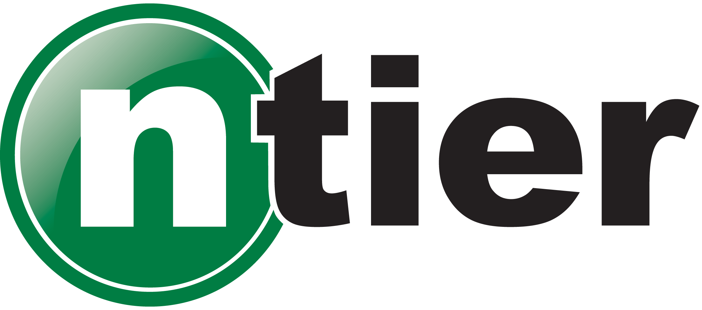

 

# Hello World Node.js App

By \<replace with yuur ame\>

## Module 1 Starter Project

This project repository is the core to start working with the Azure DevOps pipelines.
In module 1 the repository is published to the Azure DevOps Repo as the repository to build in the pipeline.
This is a simple application on purpose, our focus is not on the app but on the pipeline.